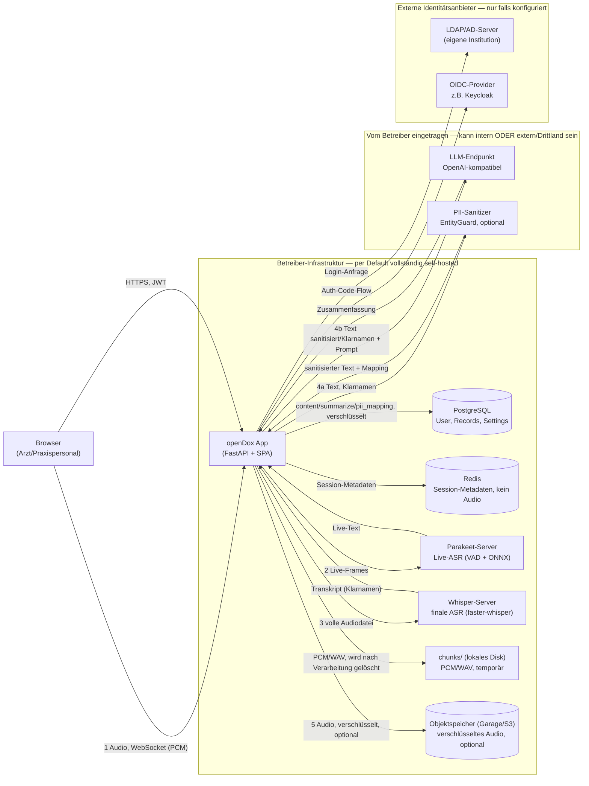

# Data Mapping

Technische Bestandsaufnahme, welche (personenbezogenen/medizinischen) Daten
durch openDox fließen, wo sie herkommen, wohin sie gehen, wo sie liegen und
wie lange. Gedacht als Ausgangspunkt für ein Verzeichnis von
Verarbeitungstätigkeiten (Art. 30 DSGVO), eine Datenschutz-Folgenabschätzung
(Art. 35 DSGVO) oder ein Gespräch mit der Rechtsabteilung/dem
Datenschutzbeauftragten — ersetzt keine Rechtsberatung und keine
Einzelfallprüfung der jeweiligen Betriebsumgebung.

**Wichtig für Betreiber:** Dieses Dokument beschreibt den Datenfluss des
Codes in diesem Repository. Die *tatsächliche* Einstufung (welche externen
Stellen als Auftragsverarbeiter gelten, ob ein Drittlandtransfer vorliegt
usw.) hängt davon ab, **wie** eine konkrete Instanz konfiguriert wird —
insbesondere, welcher LLM-Endpunkt und welcher PII-Sanitizer-Dienst
eingetragen werden (siehe unten).

## Systemübersicht

Die Nummerierung folgt dem zeitlichen Ablauf einer Aufnahme (siehe
[`docs/pii.md`](pii.md) für den detaillierten Ablauf ab Schritt 3, wenn der
PII-Sanitizer aktiv ist).

## Datenkategorien

| Kategorie | Beispiele | Wo im System |
|---|---|---|
| Gesundheitsdaten (besondere Kategorie, Art. 9 DSGVO) | Gesprochener Inhalt der Aufnahme, Transkript, Zusammenfassung | `record.content`, `record.summarize`, temporär als Audio |
| Patientenbezogene Identifikatoren | Namen, Orte, Daten, die im Transkript vorkommen (nicht strukturiert, Freitext) | Teil von `record.content`/`record.summarize`; ggf. maskiert falls Sanitizer aktiv |
| Nutzerkonto-Daten (Praxispersonal, nicht Patienten) | Benutzername, Passwort-Hash, Rolle | `User`-Tabelle |
| Zugangsdaten zu Drittsystemen | LDAP-Bind-Passwort, OIDC-Client-Secret, API-Keys für LLM/Whisper/Sanitizer | Settings-Tabellen (siehe Verschlüsselung unten) |
| Audiodaten | Rohes PCM/WAV während der Aufnahme; optional persistiertes Audio (Format konfigurierbar: MP3/WAV/FLAC/OGG) | `chunks/` (temporär, bei fehlgeschlagener Transkription länger, siehe unten), Objektspeicher (optional, dauerhaft bis Löschung) |

## Verarbeitungsschritte im Detail

| # | Schritt | Daten | Ziel/Empfänger | Code-Referenz |
|---|---|---|---|---|
| 1 | Live-Aufnahme | Rohes PCM-Audio | Lokal (`chunks/session_*.pcm`) + Parakeet-Server | `backend/views/record_api/record.py` (`/ws/record`) |
| 2 | Live-Transkription | PCM-Frames → Text | Parakeet-Server (im Stack, self-hosted) | `parakeet_server/` |
| 3 | Finale Transkription | Vollständige Audiodatei | Whisper-Server (im Stack, self-hosted) | `background_transcription_service.py` |
| 4 | PII-Sanitisierung (optional) | Transkript mit Klarnamen | Sanitizer-Endpunkt — **Adresse vom Betreiber frei konfigurierbar** | `sanitizing_service.py`, Details: [`docs/pii.md`](pii.md) |
| 5 | LLM-Zusammenfassung | Sanitisierter oder Klartext + Kategorie-Prompt | LLM-Endpunkt — **Adresse vom Betreiber frei konfigurierbar, OpenAI-kompatibel** | `backend/components/llm/llm_model.py` |
| 6 | Persistierung | Transkript, Zusammenfassung, PII-Mapping | PostgreSQL, verschlüsselt | `record_model.py` |
| 7 | Audio-Download (optional) | Komprimiertes Audio | Objektspeicher (S3-kompatibel), verschlüsselt vor Upload | `audio_storage.py`, `background_transcription_service.py` |
| 8 | Login | Zugangsdaten | Lokale DB, oder externer LDAP-/OIDC-Server | `auth_routes.py`, `ldap.py`, `oidc_routes.py` |

## Verschlüsselung im Detail

### Ruhende Daten (at rest)

| Feld/Ort | Verschlüsselt? | Mechanismus |
|---|---|---|
| `record.content`, `record.summarize`, `record.pii_mapping` | ✅ | Fernet (`ENCRYPTION_KEY`), `EncryptedString`-Spaltentyp |
| Persistiertes Audio im Objektspeicher | ✅ | Anwendungsseitig mit `ENCRYPTION_KEY` verschlüsselt **vor** dem Upload — der Objektspeicher-Anbieter sieht nie Klartext, unabhängig davon, ob er selbst Server-Side-Encryption anbietet |
| `record.title` | ✅ | Fernet (`ENCRYPTION_KEY`), `EncryptedString`-Spaltentyp |
| `LdapSettingsModel.bind_user_password` | ✅ | Fernet (`ENCRYPTION_KEY`), `EncryptedString`-Spaltentyp |
| `OidcSettingsModel.client_secret` | ✅ | Fernet (`ENCRYPTION_KEY`), `EncryptedString`-Spaltentyp |
| PCM/WAV in `chunks/` | ❌ (aber kurzlebig) | Unverschlüsselt auf Disk, wird nach erfolgreicher/fehlgeschlagener Verarbeitung immer gelöscht (siehe unten) |

Ohne gesetzten `ENCRYPTION_KEY` ist Verschlüsselung für alle oben markierten
✅-Felder **deaktiviert** (Klartext, mit Log-Warnung beim Start) — ein
gesetzter `ENCRYPTION_KEY` ist Voraussetzung dafür, dass die Zusicherungen
in diesem Dokument gelten.

### Daten in Übertragung (in transit)

Ob die Verbindung zu Whisper-/Parakeet-/LLM-/Sanitizer-/LDAP-Endpunkten
TLS-verschlüsselt ist, hängt von der jeweils **eingetragenen URL** ab
(`https://`/`ldaps://` vs. `http://`/`ldap://`) — die Anwendung erzwingt das
nicht selbst. Innerhalb des mitgelieferten Docker-Compose-/Swarm-Stacks
laufen diese Verbindungen im internen Container-Netzwerk (nicht öffentlich
erreichbar); sobald ein Endpunkt auf ein externes System zeigt, sollte
`https`/`ldaps` verwendet werden.

## Externe Stellen / mögliche Auftragsverarbeiter

**Per Default vollständig self-hosted** (Teil desselben Docker-Compose-/
Swarm-Stacks, kein separater Auftragsverarbeiter, sofern der Betreiber
nichts anderes einträgt):

- Whisper-Server (finale Transkription)
- Parakeet-Server (Live-Transkription)
- PostgreSQL, Redis
- Objektspeicher (Garage, self-hosted; siehe `garage/`)

**Vom Betreiber konfiguriert — hier entscheidet sich, ob ein Drittanbieter/
Drittland im Spiel ist:**

- **LLM-Endpunkt** — kann ein lokal betriebenes Modell sein (Ollama, vLLM)
  oder ein Cloud-Dienst außerhalb der EU. Bekommt den (ggf. sanitisierten)
  Transkript-Text zu Gesicht.
- **PII-Sanitizer (EntityGuard)** — kann self-hosted oder extern sein.
  Bekommt den **unsanitisierten** Text mit Klarnamen zu Gesicht, bevor er
  überhaupt maskiert wird.
- **Objektspeicher**, falls von Garage auf einen externen S3-kompatiblen
  Anbieter umgestellt (`S3_ENDPOINT_URL`) — bekommt nur den bereits
  verschlüsselten Audio-Blob, keinen Klartext.

**Nur Auth-Metadaten, keine Gesundheitsdaten:**

- LDAP-/AD-Server, OIDC-Provider — erhalten Anmeldedaten bzw. nehmen am
  Authorization-Code-Flow teil, sehen keine Transkriptionsinhalte.

## Aufbewahrung & Löschung

- **Rohes Audio (PCM/WAV)**: wird nach **erfolgreicher** Verarbeitung
  automatisch gelöscht, zusätzlich abgesichert durch einen
  Stale-Session-Cleanup (>30 Min. Inaktivität) und eine
  Startup-Bereinigung verwaister Dateien — siehe `AGENTS.md` Abschnitt
  „Audio File Cleanup". **Bei einer fehlgeschlagenen Transkription wird
  die Datei stattdessen unverschlüsselt in `chunks/failed/` aufbewahrt**
  (kein automatisches Ablaufdatum), damit ein Admin die Verarbeitung über
  „Fehlgeschlagene Transkriptionen" erneut anstoßen kann — sie bleibt dort
  bis zu einem erfolgreichen Retry oder einer manuellen Bereinigung durch
  den Betreiber liegen. Es gibt **keine** Konfigurationsoption, das rohe
  Audio einer erfolgreich verarbeiteten Aufnahme dauerhaft aufzubewahren —
  der Fehlerfall ist die einzige Ausnahme von der sofortigen Löschung.
- **Transkript, Zusammenfassung, PII-Mapping**: bleiben bis zur manuellen
  Löschung des Datensatzes durch einen Nutzer bestehen (kein automatisches
  Ablaufdatum).
- **Persistiertes Audio** (falls Feature aktiviert, Format konfigurierbar):
  bleibt bis zur manuellen Löschung des Datensatzes bestehen, wird dann aus
  dem Objektspeicher entfernt.

## Bekannte Lücken (Stand: siehe Git-Historie)

- Ob Verbindungen zu extern konfigurierten Endpunkten (LLM, Sanitizer, LDAP)
  TLS nutzen, liegt vollständig in der Verantwortung der Konfiguration —
  die Anwendung erzwingt es nicht.
- `chunks/failed/` (rohes Audio nach fehlgeschlagener Transkription, siehe
  oben) hat kein automatisches Ablaufdatum — liegt unverschlüsselt auf der
  Platte, bis ein Admin erfolgreich einen Retry durchführt oder die Datei
  manuell entfernt.

## Verweise

- [`docs/pii.md`](pii.md) — detaillierter Ablauf der PII-Sanitisierung
- [`DISCLAIMER.md`](../DISCLAIMER.md) — „Kein Medizinprodukt"-Hinweis
- `AGENTS.md` (Repo-Root, auch als `CLAUDE.md` verlinkt) — technische
  Architekturdokumentation, u.a. Abschnitte „Field Encryption", „Audio File
  Cleanup", „Audio Download (S3-compatible Object Storage)"